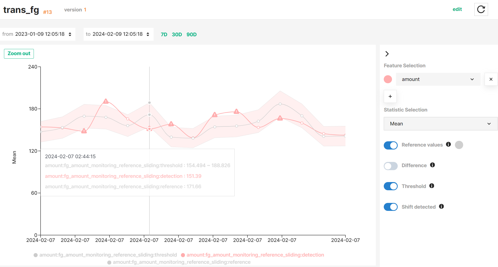

Hopsworks feature monitoring allows you to monitor your feature data once they have been ingested into the Feature Store. You can define ==detection and reference windows== over your data for which Hopsworks will compute the statistics on a regular basis, compared them, and optionally trigger alerts when significant differences are detected. Statistics can be computed on all or a subset of feature values, and on one or more features simultaneously. Also, you can specify the criteria under which statistics will be compared and set thresholds used to classify feature values as anomalous.

Hopsworks stores both detection and reference statistics and enable you to visualise the temporal evolution of statistical metrics. 

!!! tip "Interactive graph"
    See the [Interactive graph guide](interactive_graph.md) to learn how to explore statistics and comparison results more efficiently.

## Use cases

Feature monitoring is a powerful tool that allows you to monitoring your data over time and quickly detect anomalies in your feature data by comparing statistics computed on different windows of your feature data, notifying you about anomalies, and/or visualizing the evolution of these statistics and comparison results in a time series. It can be enabled in both Feature Groups and Feature Views, but for different purposes.

For **Feature Groups**, feature monitoring helps you rapidly identify unexpected trends or anomalous values in your Feature Group data, facilitating the debugging of possible root causes such as newly introduced changes in your feature pipelines.

For **Feature Views**, feature monitoring helps you quickly detect when newly inserted Feature Group data differs statistically from your existing training datasets, and decide whether to retrain your ML models using a new training dataset version or analyze possible issues in your feature pipelines or inference pipelines.

## Reference windows

To compare statistics computed on a _detection window_ against a baseline, you need to define a _reference window_ of feature data. Reference windows can be defined on different ways depending on whether you are configuring feature monitoring on a Feature Group or Feature View.

In [a previous section](index.md#statistics-computation-on-windows-of-feature-data) we described different types of windows available. Taking a Feature View as an example, the figure above describes how these windows are applied to Feature Group data read by a Feature View query and Training data, resulting in the following applications:

- A _expanding window_ covering the whole Feature Group data from its creation until the time when statistics are computing. It can be seen as an snapshot of the latest version of your feature data. This reference window is useful when you want to compare the statistics of **newly inserted feature data against all the Feature Group data**.
- A _rolling window_ covering a variable subset of feature data (e.g., feature data written last week). It helps you compare the properties of **feature data inserted at different cadences** (e.g., feature data inserted last month and two months ago). 
- A _static window_ representing a snapshot of Feature Group data read using the Feature View query at a specific point in time (i.e., Training Dataset). It helps you compare **newly inserted feature data** into your Feature Groups **against a Training Dataset version**.
- A _specific value_. It helps you target the analysis of feature data to a **specific feature and statistics metric**.

See more details on how to define a reference window for your Feature Groups and Training Datasets in the Feature Monitoring guides for [Feature Groups](../feature_group/feature_monitoring.md) and [Feature Views](../feature_view/feature_monitoring.md).

## Comparison criteria

After defining the detection and reference windows, you can specify the criteria under which computed statistics will be compared.

??? no-icon "Statistics metric"

    Although all descriptive statistics are computed on the pre-defined windows of feature data, the comparison of statistics is performed only on one of the statistics metrics. In other words, **difference values are only computed for a single statistics metric**. You can select the targeted statistics metric using the `metric` parameter when calling the `compare_on` method.
    
??? no-icon "Threshold bounds"

    Threshold bounds are used to classify feature values as anomalous, by comparing them against the difference values computed on a specific statistics metric. You can defined a threshold value using the `threshold` parameter when calling the `compare_on` method.

??? no-icon "Relative or absolute"

    _Difference_ values represent the amount of change in the detection statistics with regards to the reference values. They can be computed in absolute or relative terms, as specified in the `relative` boolean parameter when calling the `compare_on` method.

    - **Absolute**: _$detection value - reference value$_
    - **Relative**: _$(detection value - reference value) / reference value$_

??? no-icon "Strict or relaxed"

    Threshold bounds set the limits under which the amount of change between detection and reference values is ==normal==. These bounds can be strict (`<` or `>`) or relaxed (`<=` and `=>`), as defined in the `strict` parameter when calling the `compare_on` method.

Hopsworks stores the results of each statistics comparison and enables you to visualise them together with the detection and reference values in a time series graph.

!!! info "Next steps" 
    You can setup alerts that will notify you whenever anomalies are detected on your feature data. See more details in the [alerting section](index.md#alerting) of the feature monitoring guide.